# CloudShare

> *"Your files, your cloud, your control."* A cloud file-sharing platform that I built end to end during my internship at **CtrlZ**. I wrote both the Laravel backend API and the Flutter mobile app.

> **Note:** CloudShare was developed for **CtrlZ**, where I did my internship, and the source code belongs to them. This write-up describes the product, the architecture, and my work on it without sharing proprietary code.

## Overview

CloudShare lets users store files in the cloud and decide who can see each one. Every file is in one of three states:

- **Private:** only the owner can see it.
- **Shared:** visible to specific users the owner picked by email.
- **Public:** visible to every user of the platform.

I built **the whole stack** myself:

1. **Backend:** a RESTful API in **Laravel** covering authentication, profiles, file storage, and the access-control model for sharing.
2. **Mobile client:** a **Flutter** app with a light/dark design system, tabbed navigation, search, file actions, uploads, and account management.
3. **API testing:** a **Postman** collection with environment variables and test scripts that check every endpoint.

## The Problem

Sharing files usually means picking between "only me" and "anyone with the link". The goal was to give users finer control:

- Share a file with **specific people**, then see and revoke who has access.
- **Publish** a file for everyone, and take it back down at any time.
- Keep each file's state consistent as shares are added and removed.
- Make all of this easy to use from a phone.

## Backend: Laravel REST API

### Data model
I designed the relational **MySQL** schema and the Eloquent models:

- **User:** account, profile picture, and Sanctum API tokens.
- **File:** name, storage path, MIME type, size, description, owner, and a **`visibility`** field (`private` / `shared` / `public`).
- **SharedFile:** a **pivot table** (`file_id`, `owner_id`, `shared_with_id`) that grants access to individual users. It's modelled as a `belongsToMany` relationship from `File` to `User`.
- **FilePublic:** records public exposure of a file, with an access level.

Keeping "shared with specific people" and "public" as separate concerns made the access rules clearer and easier to maintain.

### Authentication (Laravel Sanctum)
- `register`, `login`, `logout`, and `user` endpoints using **token-based auth**.
- Passwords hashed with `Hash::make` and checked with `Hash::check`. A failed login returns `401`.
- Every non-auth route is grouped under the `auth:sanctum` middleware. The Flutter app sends a `Bearer` token with each request.

### Profile management
- View, update, and delete the authenticated user's profile.
- **Profile picture lifecycle** on Laravel's public storage disk. Uploading a new picture replaces the old one and deletes the old file from disk, and the user can also remove the picture entirely.
- Changing the email resets `email_verified_at`, so the new address has to be verified again.
- Deleting the account requires the user's **current password**. It deletes the profile picture, revokes all API tokens, and removes the account.
- Validation is handled by a dedicated **Form Request** class, which keeps the controllers thin.

### File operations
- **List** the authenticated user's files.
- **Upload** with validation (5 MB limit). The server records the original name, MIME type, size, and description, and new files start as `private`. A successful upload returns `201 Created`.
- **Download** with layered checks: the file record exists → the user is allowed to see it (owner, shared-with, or public) → the file exists on disk.
- **Delete** with an ownership check. The file is removed from both the database and storage.

### Sharing and publishing
- **Share by email:** the owner sends a list of emails. Each one is resolved to a user, access is granted with `updateOrCreate` (so repeating a share is safe and doesn't duplicate it), and the file moves to `shared`.
- **List shares:** returns files the user owns or that were shared with them, with the owner eager-loaded to avoid N+1 queries.
- **Manage access:** the owner can see every email a file is shared with and revoke specific people. When the last share is removed, the file automatically goes back to `private`.
- **Publish / unpublish:** make a file public for everyone, or revert it to private.
- Every write endpoint checks **ownership** before changing anything.

### Testing and self-review
I built a **Postman** collection covering all of the auth, profile, file, sharing, and public endpoints. It uses a `base_url` environment variable and a **test script that saves the token from the login response** automatically, so the protected endpoints can be run straight after logging in. I checked status codes, response shapes, and access rules (for example, a private file must only be downloadable by its owner).

I also reviewed my own API critically and wrote down concrete improvements: rate limiting on login (`throttle`), mitigating **email enumeration** in the share endpoint, more semantic status codes (`201` / `422`), revoking only the current token on logout, cleaner REST route naming, stricter image validation, and moving authorization into Laravel **Policies**.

## Mobile App: Flutter

### Architecture
- A **service layer** (`lib/services/`) separate from the UI:
  - `api_constants.dart`: a single base-URL setting for every request.
  - `auth_service.dart`: login, register, and token access.
  - `file_service.dart`: list, download, delete, share, unshare, publish, and fetch shared and public files.
  - `profile_service.dart`: profile read and update, picture upload and removal.
- **Persistent sessions:** the token and user ID are stored in **SharedPreferences**, so the user stays signed in after restarting the app.
- **Uploads** are sent with `http.MultipartRequest`, and files are picked with **file_picker**.

### Design system
- A central `app_theme.dart` defines matching **light and dark `ThemeData`** themes: colors, app bars, inputs, buttons, and snack bars.
- The app follows the **system theme**, and users can also switch it manually from the welcome and settings screens.
- Rounded, card-based Material design throughout, with **Hero** animations and **Fade/Slide transitions** between screens.

### Screens and features
- **Welcome:** logo and tagline, with entry points to log in or register.
- **Login and Register:** validated forms, clear error messages in snack bars, and an automatic redirect into the app on success.
- **Main layout:** a bottom `NavigationBar` with four tabs (My Files, Public, Shared, Settings). An **`IndexedStack`** keeps each tab's state when switching, and `GlobalKey`s refresh a tab's data when it's opened. The user's avatar is shown in the app bar.
- **My Files:** a live search by name or description, file cards with status, and a **bottom-sheet action menu** (Download, Share, Make Public, Details, Delete, Open). Deleting asks for confirmation, and a floating **Upload** button opens the upload screen.
- **Public Files:** split into **"My Files" and "Others' Files"** tabs using the stored user ID. The owner can remove a file from public, and empty lists show friendly messages.
- **Shared Files:** **"I Shared" and "Shared With Me"** tabs. The owner can see who has access and revoke it.
- **Share dialog:** add recipients as **email chips**, with format validation and duplicate prevention.
- **Upload:** pick a file, which fills in the name automatically, add an optional description, and see a progress indicator while it uploads.
- **Settings:** edit name, email, and profile photo; log out; and **delete the account after confirming the password**.
- **Consistent feedback:** green and red floating snack bars with icons for every success and error.

## Challenges & Learnings

- **Designing access control.** Supporting private, shared, and public states at the same time, and making sure state changes are correct (for example, a file goes back to `private` when its last share is revoked), required careful data modelling and ownership checks on every endpoint.
- **Working across the full stack.** Writing the API and the client myself meant designing JSON responses for how the Flutter app actually uses them, and fixing problems on whichever side caused them.
- **API security.** Building token auth from scratch taught me about mass-assignment protection, password confirmation for destructive actions, rate limiting, and preventing user enumeration.
- **Keeping UI state in Flutter.** `IndexedStack`, `GlobalKey`-triggered refreshes, and filtering on the client side kept navigation fast without reloading everything.
- **Testing and documentation.** Testing every endpoint in Postman before connecting the UI found mismatches early (field names, URL generation), when they were cheap to fix.

## Screenshots

### Onboarding & Authentication
| Welcome (Light) | Welcome (Dark) | Login | Register |
|:---:|:---:|:---:|:---:|
| 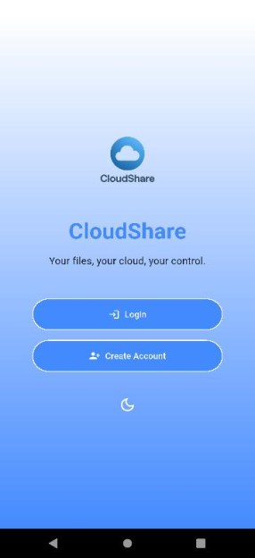 | 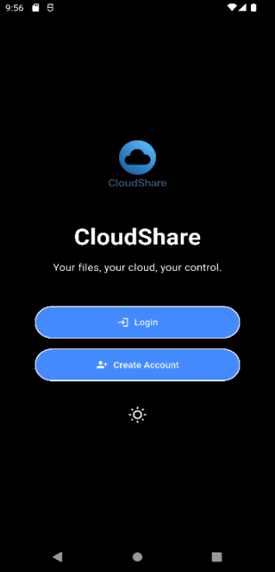 | 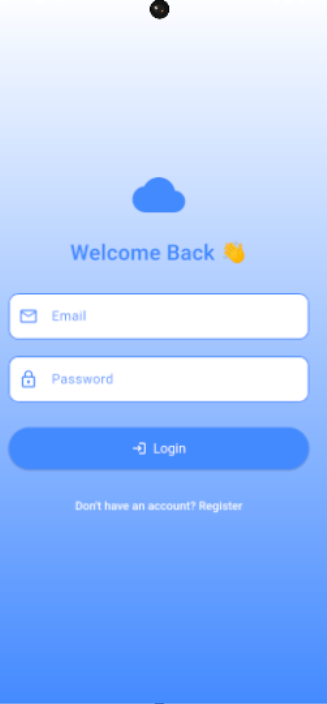 |  |

### File Management
| My Files | File Actions | Upload | Share by Email |
|:---:|:---:|:---:|:---:|
| 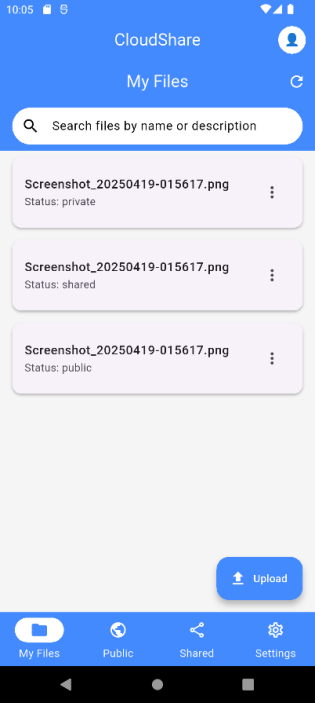 | 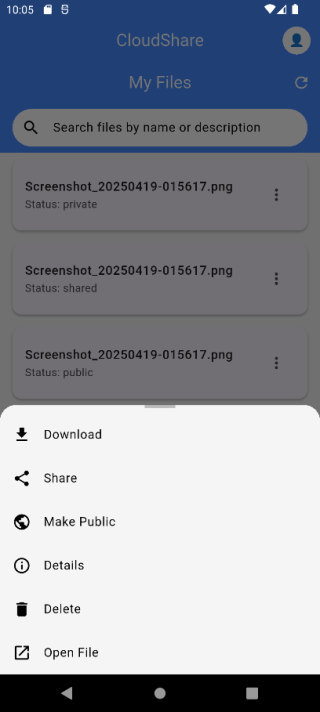 | 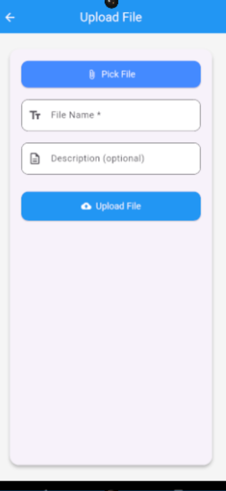 | 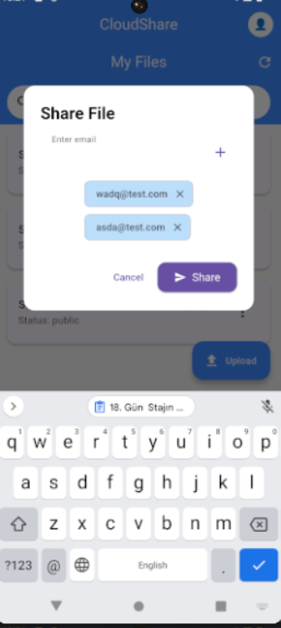 |

### Public, Shared & Settings
| Public Files | Shared Files | Settings | Edit Profile | Delete Account |
|:---:|:---:|:---:|:---:|:---:|
| 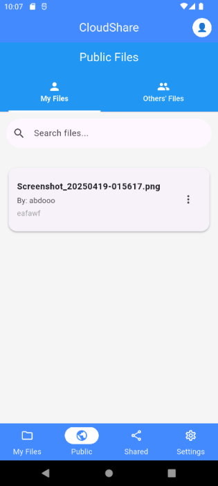 | 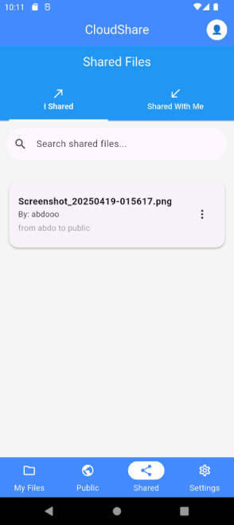 | 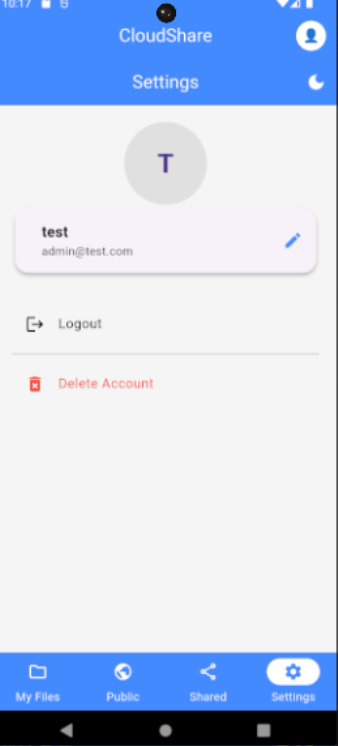 | 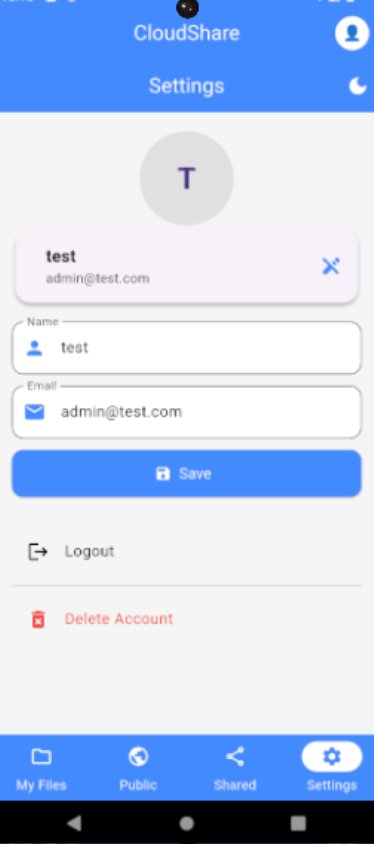 | 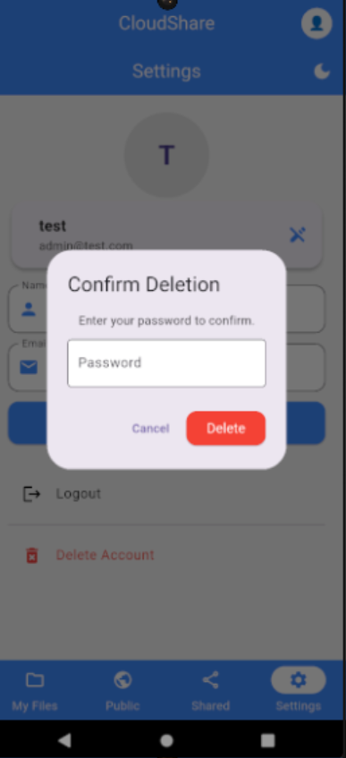 |

## Project Facts

| | |
|---|---|
| **Role** | Full-stack developer: backend API, mobile app, and API testing |
| **Context** | Internship project at CtrlZ |
| **Year** | 2025 |
| **Backend** | Laravel (PHP), MySQL, Sanctum, Eloquent ORM, Laravel Storage |
| **Mobile** | Flutter (Dart), Material Design, SharedPreferences, file_picker |
| **Tooling** | Postman (environments + test scripts), VS Code |
| **Source** | Proprietary, owned by CtrlZ |
