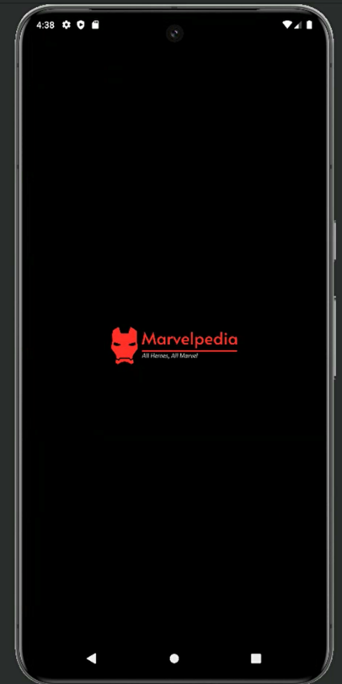
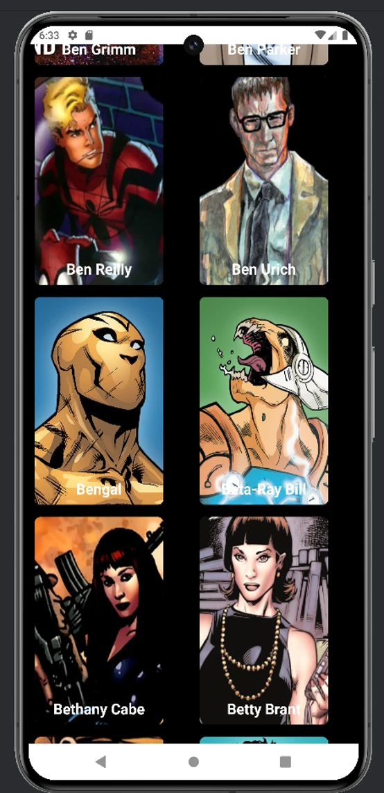
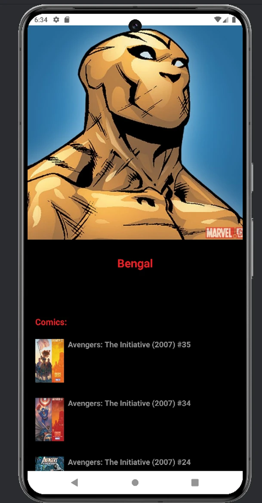

# Marvel's Comic Books

> My first solo project: a native Android app that turns the Marvel Comics API into a fast, browsable gallery of heroes and their comics.

## Overview

Marvel's Comic Books is a native Android application written entirely in **Kotlin**. It connects to the official **Marvel Developer API** to let users:

- Scroll through an **endless grid of Marvel characters**, each shown as a card with artwork and name.
- Tap a character to open a **detail screen** with a full-size portrait, name, and description.
- See the character's **10 most recent comics** (from 2005 to today, newest first), each with its cover art.

I designed, built, and shipped it alone. That meant setting up the project, choosing the architecture and libraries, integrating the API, building the UI, and handling a very slow backend.

## The Problem

The Marvel API has decades of character and comic data, but it isn't easy to work with:

- Every request must be **signed**. You send a timestamp, your public key, and an MD5 hash of `timestamp + privateKey + publicKey`.
- Responses are **large and deeply nested** (wrappers → containers → results → summaries).
- During development the server was **very slow**. The home screen averaged **~60 seconds** per response and the detail screen **~50 seconds**.

The goal was an app that feels smooth and is easy to browse despite those limits.

## The Solution & Key Features

### Infinite-scroll character gallery
- A two-column `GridLayoutManager` grid of Material cards with a dark, Marvel-red theme.
- **Offset-based pagination.** Characters load in batches of 30. When the user reaches the bottom of the list and scrolling stops, the next page is requested.
- A **loading guard** (`isLoading`) stops the same page from being requested twice while a slow call is still running. When the API returns an empty page, the user is told there are no more characters.
- New pages are appended through `AsyncListDiffer`, so list updates are computed off the main thread and only the changed items are redrawn.

### Character detail screen
- Navigation uses the **Jetpack Navigation Component**. The character ID is passed type-safely with **Safe Args**.
- The character details and the character's comics are fetched with **two requests in parallel**. Each section has its own progress indicator, so the hero shows up as soon as it's ready without waiting for the comics.
- The comics query is narrowed on the server side: `format=comic`, `dateRange=2005-01-01..today`, `orderBy=-onsaleDate`, `limit=10`. Only the most relevant issues are downloaded.
- **Requests are cancelled in `onDestroyView()`.** If the user leaves the screen during a 50-second call, the request stops, which saves bandwidth and avoids callbacks into a destroyed view.

### Polished image loading
- A **custom Glide module** (`@GlideModule`) generates a `GlideApp` API.
- Images use cross-fade transitions, placeholder and error drawables, and center-crop or fit-center scaling depending on the screen.
- `network_security_config.xml` is set up so the Marvel image CDN, which serves some images over plain HTTP, loads correctly.

### Branded launch experience
- A custom **Android 12+ SplashScreen API** splash with the Marvel logo on black, then a switch to the app theme.
- Custom adaptive launcher icon and a consistent Marvel color palette (`#ED1D24` red on near-black grays).

## Architecture & Technical Highlights

```
UI (Fragments + ViewBinding)
   │   CharactersFragment ──Safe Args──▶ CharacterDetailsFragment
   │   RecyclerView adapters (AsyncListDiffer)
   ▼
ApiRepository  (@ActivityScoped, injected by Hilt)
   ▼
MarvelApiService  (Retrofit interface)
   ▼
OkHttpClient  (logging + request interceptors, custom timeouts)
   ▼
Marvel REST API  (gateway.marvel.com/v1/public)
```

- **Dependency injection with Dagger Hilt.** `@HiltAndroidApp` application, `@AndroidEntryPoint` activity and fragments, and an `ApiModule` that provides singleton instances of the base URL, `OkHttpClient`, `Gson`, and the Retrofit service. The adapters and the repository are injected with constructor injection.
- **Repository pattern.** The UI only talks to `ApiRepository`, which wraps the Retrofit `MarvelApiService`. Networking is kept separate from the screens.
- **A typed Retrofit API** with three endpoints: the paginated character list, a single character, and a character's comics with filters. Kotlin data classes model the full Marvel response schema (`DataWrapper → DataContainer → results`, plus `Image`, `Url`, `ComicList`, `StoryList`, `EventList`, `SeriesList`, and more).
- **Build-type-aware HTTP logging.** Full request and response bodies are logged in `DEBUG` builds, and logging is off in release builds.
- **Timeouts tuned for the backend.** Connect, read, and write timeouts were raised to 100 seconds so the slow API wouldn't cause spurious failures.
- **Error handling.** HTTP status codes (401, 403, 405, 409) and network failures are shown to the user as clear messages instead of crashing the app.
- **Modern Gradle setup.** Kotlin DSL build scripts, a version catalog (`libs.versions.toml`), kapt for Hilt and Glide annotation processing, and ViewBinding and BuildConfig enabled.

## Challenges & Learnings

**A very slow API.** At 50–60 seconds per call, the default network settings failed outright. I measured response times, raised the client timeouts, limited the page size, and added explicit loading states for each section so the app always shows what's happening. I also prototyped a **retry interceptor** for transient I/O failures, and I left notes on the production approach: smaller batches, **prefetching**, and **caching data for offline use**.

**Pagination without duplicates.** Starting a load whenever the user hits the bottom of the list can easily send the same request several times. The loading flag combined with the "can't scroll further and scroll is idle" check makes sure each page is fetched exactly once.

**Lifecycle-safe networking.** Cancelling in-flight calls when a fragment's view is destroyed taught me how Android lifecycles and long-running work interact.

**Iterating on the architecture.** The project began as an Activity-based app with a hand-written Retrofit singleton. I refactored it into a single-activity, fragment-based app with Navigation and Hilt-provided dependencies. The earlier version is kept in an `old/` package to show that progression.

### What I'd do next
Looking back, here's how I'd take it further:
- Move state into **ViewModels** with **Kotlin Coroutines/Flow** instead of Retrofit callbacks.
- Replace the manual pagination with **Paging 3**, and add a **Room** cache for offline browsing.
- Move the API keys out of source code into `local.properties` / BuildConfig fields, or behind a backend proxy.
- Add unit tests for the repository and UI tests for navigation.

## Screenshots

<!-- Drop images into /projects/images/marvels-comic-books/ and reference them below. -->

| Splash | Characters | Character Details |
|:------:|:----------:|:-----------------:|
|  |  |  |

## Project Facts

| | |
|---|---|
| **Role** | Solo developer (design, architecture, implementation) |
| **Timeline** | Jul 2024 – Aug 2024 (~3 weeks) |
| **Platform** | Android, min SDK 28 (Android 9), target SDK 34 (Android 14) |
| **Language** | Kotlin |
| **Source** | [github.com/saidBar/MarvelsComicBooks](https://github.com/saidBar/MarvelsComicBooks) |
