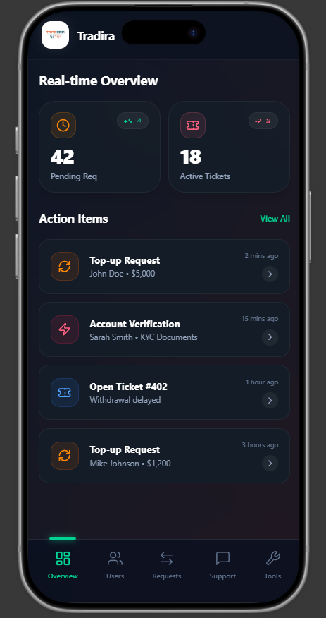
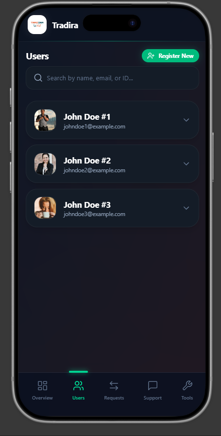
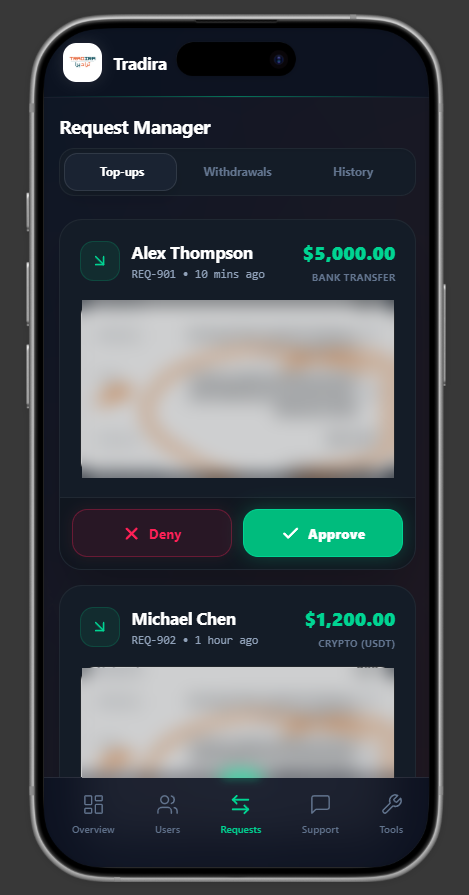
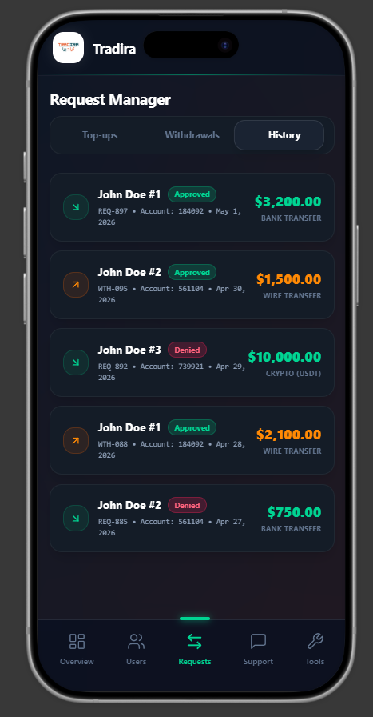
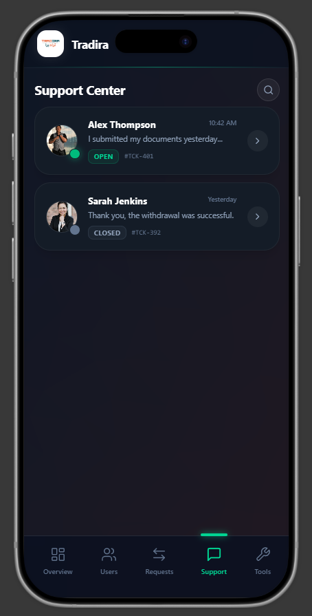
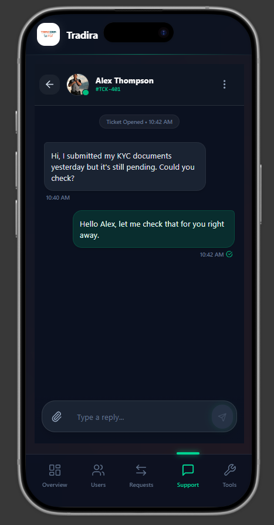
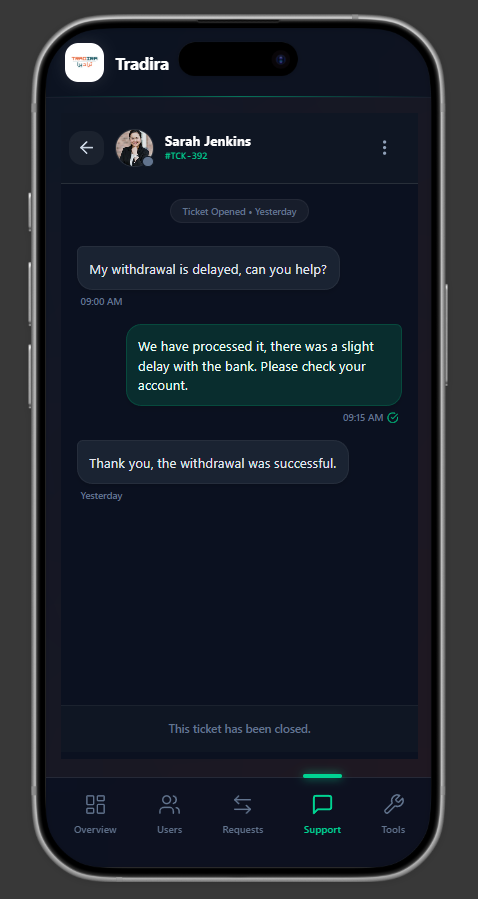
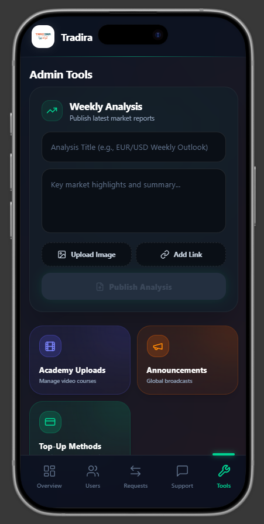

# Tradira

> A secure investment-management ecosystem, **delivered to a client and used by 600+ users**: **two Flutter apps** (investors and admins) on **one locked-down Firebase backend**. I designed the product in **Figma** and built everything myself: the data model, the security, the backend, and both apps.

> **Note:** Tradira is a client project. The source code is private, so this page describes the system and my work on it without sharing proprietary code.

## Overview

Tradira connects an investment firm with its clients:

- **Tradira (User App):** investors request access, manage multiple investment accounts, submit top-up and withdrawal requests, chat with support, and read market analysis and academy content.
- **Tradira Admin (Control Center):** super admins and staff review onboarding requests, approve or reject financial requests, manage users and their accounts, answer support tickets in real time, and publish announcements, weekly analysis, and academy videos.

Both apps run on **Android and iOS**, share one visual identity, and use the same **Firebase** backend.

The project rests on three things:

1. **Security**, built in from the start rather than added later.
2. **A rich, audit-ready database** that already supports the client's future features.
3. **A polished, data-focused design** that makes complex financial work feel simple.

---

## Security

Tradira handles identity and money, so **security was the first design decision, not the last.** The system uses several independent layers. Getting past one layer is never enough to reach privileged data.

### Layer 1: No way in without approval
- **Neither app has a public sign-up.** The admin app only shows a login screen, and the investor app only offers an **access request form**.
- **The first super admin is seeded manually** in the Firebase console, and its admin profile is created by hand. No code path can create a super admin.
- **Only a super admin can create other admins and staff**, through a protected server function. A normal admin or an investor who calls it is rejected on the server.

### Layer 2: The server decides everything privileged
- Every sensitive operation runs in a **callable Cloud Function** using the Admin SDK: creating users, approving or rejecting onboarding, approving financial requests, opening accounts, and deleting users. **The client apps never write privileged data directly.**
- Every function starts with an **authorization guard** (`assertActiveAdmin` / `assertSuperAdmin`) that checks the caller's **custom claims** and their **live admin record**. A disabled admin loses access immediately, even if their token is still valid.
- **Role-based access control (RBAC):**
  - **Super admins** can approve onboarding, create staff, and perform destructive actions.
  - **Staff** handle day-to-day work and get notifications, but can't approve new users or delete anyone.
  - **Investors** can only touch their own data.
- **Typed input validation** runs on the server before any financial or identity-related write: field shapes, allowed currencies (USD/EUR/TRY), and the allowed language codes.

### Layer 3: The database protects itself
- **Firestore security rules** cover every collection (`admins`, `users`, `onboarding_requests`, `requests`, `tickets`, `messages`, `content_feed`) and enforce:
  - **Ownership:** an investor can only read their own profile, accounts, requests, and tickets.
  - **Write-path restrictions:** investors can only *create* specific document types, such as a request or a ticket, and never change their status, balance, or role.
  - **Schema validation on create:** for example, an onboarding request must contain exactly the allowed fields, and `preferred_language` must be `en` or `ar`.
- Even if someone modified an app, the rules and functions would still reject the request.

### Layer 4: Identity handled safely
- **The onboarding form never collects a password.** Storing passwords next to a pending request would be a risk, so the system avoids it entirely.
- When a request is **approved**, a function creates the Firebase Auth account and emails a **one-time password-setup link**. The investor sets their own password through Firebase's secure flow.
- Changing an email or deleting an account requires re-verification. **Deleting a user is a deliberate two-step action:** the admin must type the user's exact email to confirm, and the server checks it again before deleting the account and all of its data.

### Layer 5: Privacy-conscious UI and an audit trail
- Admin screens show **account numbers but never balances**, so sensitive figures don't appear where they aren't needed.
- Every financial request records **who reviewed it, when, and their internal notes**, plus an **audit trail** with external transaction references. Every onboarding decision records who processed it, when, and the rejection reason.
- **Device tokens are validated and invalid ones pruned** automatically, so push notifications never go to stale devices.

---

## The Database

I designed the Firestore schema **for the product the client will need in two years, not just for this release.** Every important event is stored in detail, so features like transaction history, financial reports, compliance reviews, or customer tiers can be built later **without a migration.**

### Collections at a glance

| Collection | Purpose |
|---|---|
| `admins/{uid}` | Super admin and staff accounts, roles, active status, device tokens, language |
| `users/{uid}` | Full investor profile, status, security metadata, and cached financial summary |
| `users/{uid}/accounts/{id}` | Multiple investment accounts per investor, each with its own balances and limits |
| `onboarding_requests/{id}` | Access requests and their review workflow |
| `requests/{id}` | **One ledger** for every top-up and withdrawal |
| `tickets/{id}` | Support tickets with assignment, priority, and unread counters |
| `tickets/{id}/messages/{id}` | Real-time chat messages with delivery and read state |
| `content_feed/{id}` | Announcements, weekly analysis, and academy videos |

### What each document holds

**Investor (`users`)** is grouped into clear sections:
- `profile`: first and last name, unique email, E.164 phone number, avatar, created / updated / last-login timestamps.
- `system_status`: active flag (setting it to false locks the user out), verified flag, **risk profile tier**, **compliance status** (approved / pending / flagged).
- `security_metadata`: push device tokens, preferred language, timezone.
- `financial_summary`: **cached totals** (deposited, withdrawn, active investment, net profit/loss), so dashboards load fast without adding up the whole ledger.

**Investment account (`users/{uid}/accounts`)**: one investor can hold several accounts:
- A unique **account number** (e.g. `TRAD-2026-…`), account name, and currency.
- `balances`: **available** (can be withdrawn), **held** (locked in open requests or investments), and **total equity**.
- `account_metadata`: active flag, created and activated dates, **daily withdrawal limit**.
- Settings reserved for **future tier features** (fee multiplier, auto-reinvest).

**Financial ledger (`requests`)**: top-ups and withdrawals share one consistent structure:
- Investor and **target account**, type, amount, currency.
- `payment_details`: method (bank transfer, crypto, local wallets), **proof-of-payment screenshot**, payout bank details for withdrawals.
- `lifecycle`: status (pending / approved / rejected), created and reviewed dates, **reviewing admin**, **internal notes**.
- `audit_trail`: external transaction reference and a system log hash for compliance checks.

**Onboarding (`onboarding_requests`)**: the applicant's details and language, a `workflow` block (status, submitted and processed dates, processing admin, rejection reason), and a **device fingerprint** (IP address, operating system).

**Support (`tickets` + `messages`)**: ticket subject, category, **priority**, open/closed status, assigned admin, and **unread counters for each side**. Each message records the sender and their role, text and attachments (image/PDF), and **delivered / read** status with timestamps.

**Content (`content_feed`)**: type (announcement / weekly analysis / academy), author, payload (text, media, video link), **scheduling with automatic expiry** (weekly analysis expires after 7 days), and **engagement metrics** (view count, target audience).

### Why it matters
- **Nothing is ever lost.** Every top-up or withdrawal is stored permanently with its full lifecycle, so a "transaction history" screen or a monthly report is just a new query.
- **Ready to grow.** Tiers, risk profiles, compliance flags, withdrawal limits, and engagement analytics already have fields in the data model.
- **Fast reads.** The cached financial summaries and the counters on tickets and requests keep dashboards and badges quick and cheap.

---

## Design

I designed Tradira in **Figma** as a **professional, dark-themed fintech control center**, then rebuilt every screen as **native Flutter widgets** on a shared theme.

### Visual identity
- **Modern and minimal, with high contrast:** white and light-gray text on a **deep charcoal/navy** background, which is easy on the eyes during long sessions.
- **Colors that carry meaning:** **emerald green** for approvals and positive states, **crimson red** for alerts, rejections, and dangerous actions. Admins can read the state of the screen at a glance.
- **Typography:** clean, geometric **Inter / SF Pro** for clear numbers and labels.
- **A "bento box" layout:** information sits in neat, rounded tiles of different sizes, so a dense dashboard still feels calm and organised.
- **One theme across both apps:** shared design tokens (colors, typography, radii, components) make the two apps feel like one product.

### Admin control center screens
- **Dashboard:** a header of **live stat tiles with badge counters** (pending requests, active tickets, weekly volume), above a vertical feed of **action items** (latest top-up requests and open tickets). An admin sees what needs attention as soon as the app opens.
- **User management:** a **search-first** screen. Tapping a user **expands their card** to show their account profiles (name and account number), with quick actions and a clearly separated **red danger zone** for deletion.
- **Request manager:** **tabs** for Top-ups, Withdrawals, History, and Onboardings. Top-up cards show a **thumbnail of the payment screenshot**, with **green Approve** and **red Deny** actions.
- **Support center:** a list of chat threads with **open/closed status tags** and online indicators. Each one opens into a **real-time admin-to-investor chat** with message bubbles, timestamps, **read receipts**, and attachments. Closed tickets become read-only history.
- **Admin tools:** an inline **weekly analysis composer** (title, summary, image upload, external link), followed by color-coded tiles for **academy uploads**, the **global announcement composer** (text + image), and **top-up method management**, where admins control which payment methods investors see.

### Investor app
The same dark, premium look, focused on clarity: a clean access-request form, a dashboard of investment accounts, simple top-up and withdrawal flows with proof upload, support chat, and a content area for announcements, weekly analysis, and academy videos.

### Bilingual, right to left
Every screen is fully localized in **English and Arabic**, with a proper **right-to-left** layout for Arabic.

---

## Architecture

```
 ┌──────────────┐        ┌──────────────────────────────┐        ┌──────────────┐
 │   user_app   │        │           Firebase           │        │  admin_app   │
 │  (Flutter)   │◀──────▶│ Auth · Firestore · Storage   │◀──────▶│  (Flutter)   │
 │  Riverpod    │ streams│ Security Rules · FCM         │ streams│  Riverpod    │
 └──────┬───────┘        │                              │        └──────┬───────┘
        │   callables    │  Cloud Functions (TypeScript)│  callables    │
        └───────────────▶│  RBAC · onboarding · ledger  │◀──────────────┘
                         │  triggers · email delivery   │
                         └──────────────┬───────────────┘
                                        ▼
                         Locale-aware transactional email
```

- **Monorepo:** `admin_app/`, `user_app/`, `functions/`, and Firebase config (rules, indexes, emulator) in one workspace.
- **Feature-first, clean architecture:** business logic lives in repositories and **Riverpod** providers, separate from the widgets.
- **Real-time by default:** Riverpod `StreamProvider`s on Firestore keep badge counters, request queues, and chat up to date without refreshing.

## Key Features

### Real-time admin notifications
- When an investor submits a request, a **Firestore trigger** does two things in parallel:
  - sends a **push notification to every active admin and staff device**, in **each admin's own language**;
  - sends the investor a "we received your request" email.
  Each is logged separately, so a failure in one doesn't block the other.
- **Deep linking:** tapping the notification opens **Requests → Onboardings** directly.

### Onboarding with locale-aware emails
Each applicant receives up to three emails, all in the language they used:

| # | When | Email |
|---|---|---|
| 1 | Right after submitting | Request received, review pending |
| 2a | Admin approves | Welcome + one-time password-setup link |
| 2b | Admin rejects | Decision + the admin's reason |

The email text is kept in one server-side file that mirrors the apps' localization files, so the wording stays consistent in both languages.

### Investor accounts and financial requests
- After approval, investors can **open additional investment accounts** in USD, EUR, or TRY.
- Each **top-up** includes a proof-of-payment screenshot, and each **withdrawal** includes payout details. Both go to the admins' Requests manager for review.

### Support, content, and academy
- **Ticket-based support** with **live chat** and read receipts.
- **Announcements**, **weekly market analysis** that expires automatically, and an **academy** with a built-in video player.

## Engineering Process

I delivered Tradira in **planned phases**, each with explicit goals, file-level scope, and a test checklist:

1. **Foundation:** app shells, Riverpod, Firebase Auth, the navigation structure, the shared theme, rules, indexes, and the emulator.
2. **Backend security and data model:** RBAC functions, the onboarding approval flow, security rules, and typed validation.
3. **Admin app:** the control center built natively from the Figma designs, on live Firestore streams.
4. **User app:** onboarding, authentication, dashboard, accounts, financial requests, support, and content.
5. **QA and release:** widget tests, Functions tests for RBAC and onboarding, an **emulator smoke-test script**, full localization, and documented seeding and deployment steps.

## Challenges & Learnings

- **Security across every layer.** With no self-registration, a seeded super admin, user creation only on the server, and rules that check the data's shape, I had to think through every path where privileges could leak *before* building the UI.
- **Designing a database for the future.** Choosing what to store now (audit trails, tiers, compliance, engagement) so the client's future requests won't need migrations.
- **Push notifications across roles and languages.** Sending to many admin devices in different languages, cleaning up stale tokens, and deep-linking into nested tabs.
- **From design to native code.** Turning the Figma designs into reusable, themeable Flutter components that stay consistent in two apps and two text directions.

## Screenshots

### Admin Control Center

| Real-time Overview | Users | Request Manager — Top-ups | Request Manager — History |
|:---:|:---:|:---:|:---:|
|  |  |  |  |

| Support Center | Live Support Chat | Closed Ticket | Admin Tools |
|:---:|:---:|:---:|:---:|
|  |  |  |  |

## Project Facts

| | |
|---|---|
| **Role** | Lead / sole developer: product design, architecture, backend, admin app, user app |
| **Client** | Private client (investment firm) |
| **Status** | Delivered, in production with **600+ users** |
| **Platforms** | Android & iOS (two Flutter apps) |
| **Design** | Figma → native Flutter with a shared design system |
| **Backend** | Firebase: Auth, Firestore, Cloud Functions (TypeScript), FCM, Storage |
| **Security** | No-registration model, RBAC with custom claims, server-only privileged writes, Firestore rules, audit trail |
| **State management** | Riverpod |
| **Languages** | English & Arabic (RTL) |
| **Source** | Private (client-owned) |
